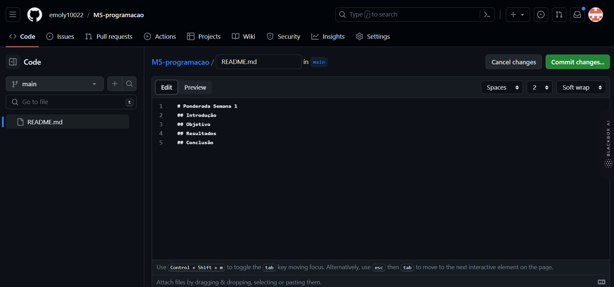
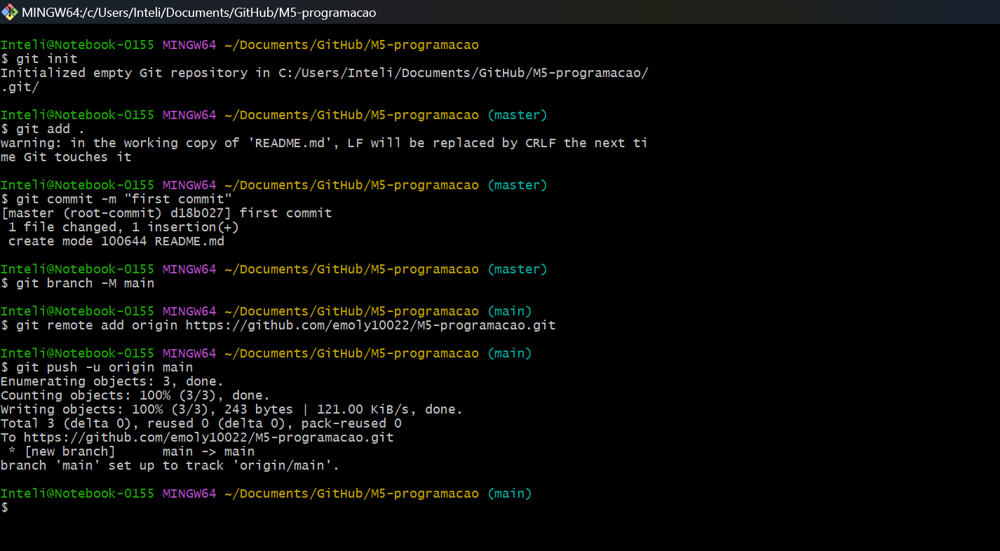
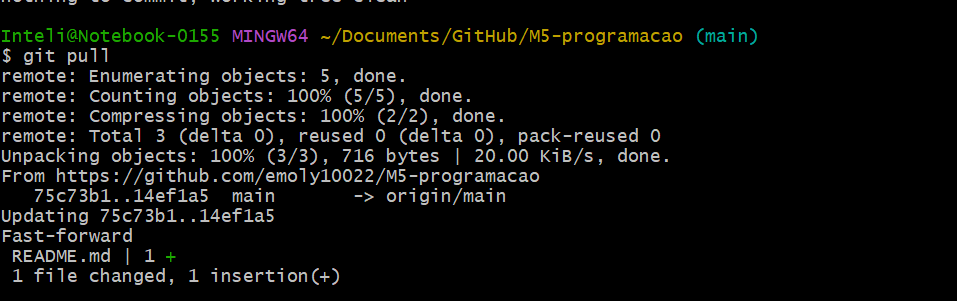
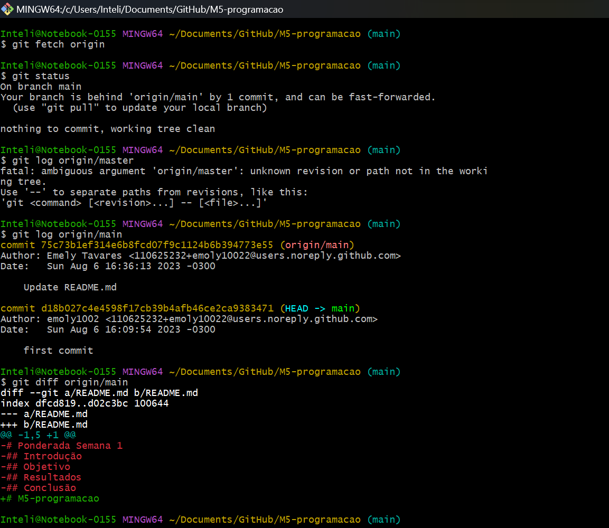
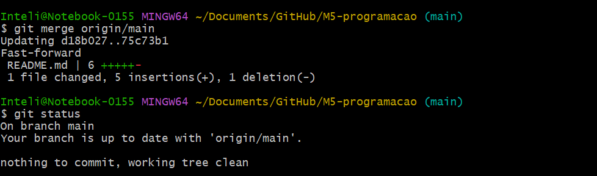
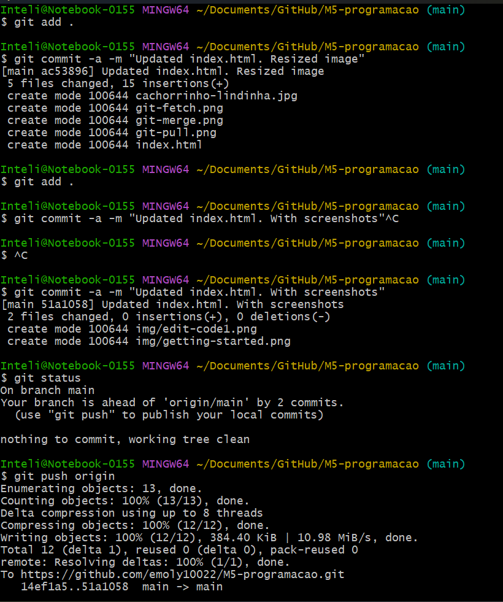
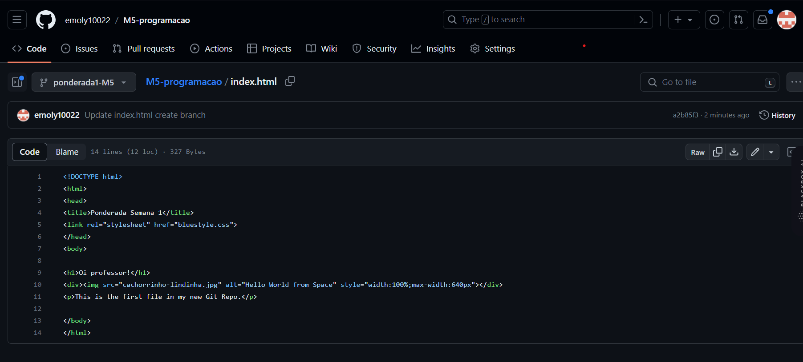
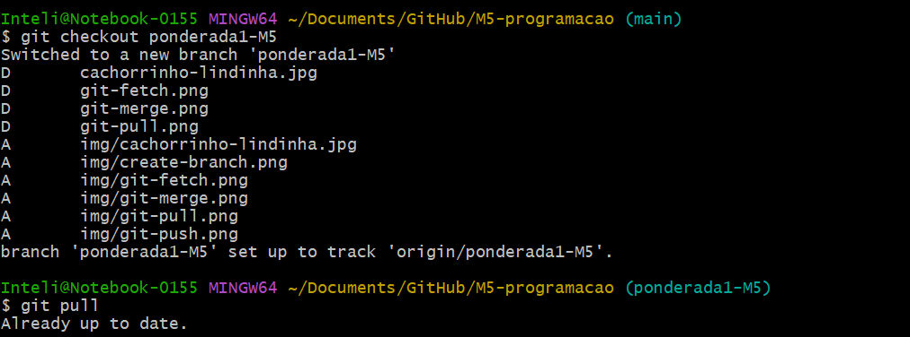
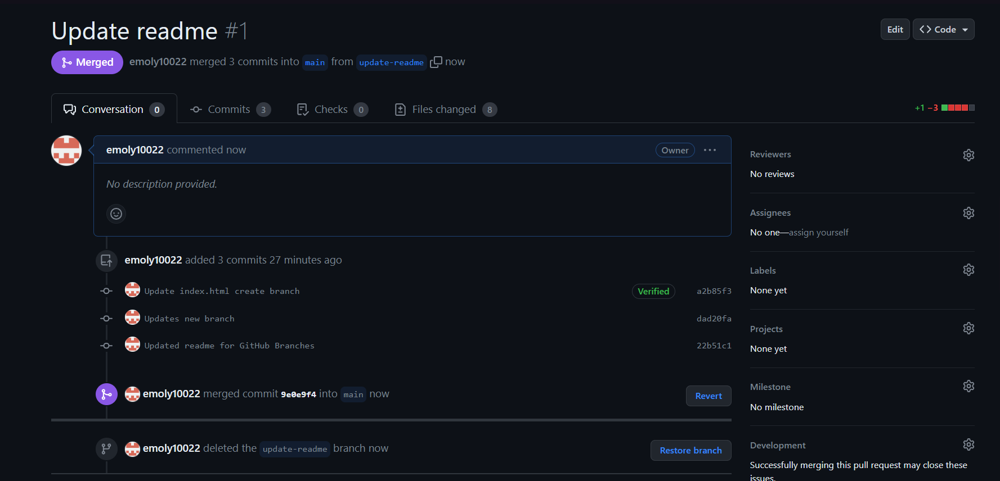

# Ponderada Semana 1
## Introdução 
Relatório do tutorial do W3 Schools sobre GitHub, um tutorial que explora várias etapas relacionadas ao uso do GitHub para controle de versão e colaboração em projetos de software. 
## Objetivo 
O objetivo deste relatório é seguir o tutorial e criar a documentação em um repositório GitHub. Para isso, seguiremos as seções do tutorial, que incluem GitHub Get Started, GitHub Edit Code, Pull from GitHub, Push to GitHub, GitHub Branch, Pull Branch from GitHub e Push Branch to GitHub.
## Resultados 
O tutorial começa pela criação de um novo repositório onde serão feitos os comandos. Logo após temos o primeiro commit de uma alteração no readme:

Seguimos para o entendimento do que é um pull (traz as alterações -commits- feitas no repositório remoto para o repositório local) e como ele pode ser feito diretamente: 

Ou por meio dos comandos fetch: 

e merge juntos: 
 

Com esses conhecimentos, vamos agora para o push, que é o envio da alterações feitas localmente para o GitHub:

Nessa etapa do tutorial criamos uma nova branch: 

e logo após mudamos para essa nova branch criada:

Fazendo as alterações necessárias de acordo com o tutorial, seguimos para a última fase, o pull request, que é o jeito de propor mudanças. Nele esperamos a revisão de algum membro da equipe e esperamos para que nossas mudanças sejam aprovadas ou vetadas:

## Conclusão

O tutorial proporcionou uma sólida compreensão do funcionamento da plataforma, incluindo a criação e gerenciamento de repositórios, o uso de branches e pull requests. Aprendi a importância do controle de versão e da colaboração eficiente no desenvolvimento de projetos. Esses conhecimentos serão valiosos para aprimorar minha prática como desenvolvedora, facilitando a organização e colaboração durante esse e os próximos projetos.